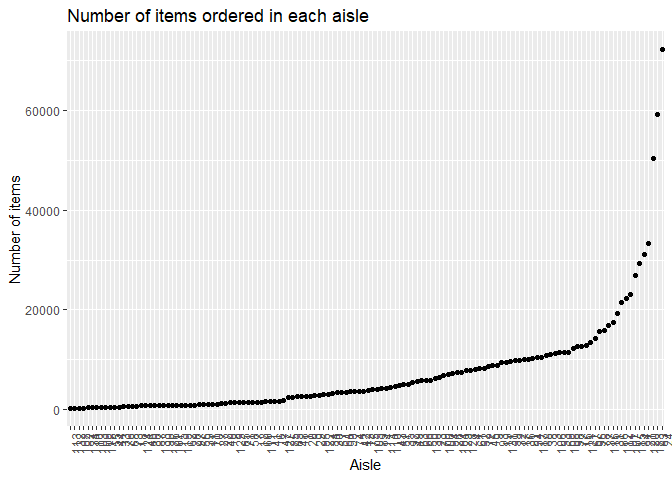

p8105\_hw3\_rh2916
================
Rui Huang
October 6, 2018

## Problem 1

``` r
library(p8105.datasets)
data(brfss_smart2010)
```

``` r
problem1_data =
  brfss_smart2010 %>%
  janitor::clean_names() %>%
  filter(topic == "Overall Health" ) %>%
  mutate(response = as.factor(response)) %>%
  select(-class, -topic, -question, -sample_size, -(confidence_limit_low : geo_location))
```

### In 2002, which states were observed at 7 locations?

``` r
problem1_data %>%
  filter(year == 2002) %>%
  group_by(locationabbr) %>%
  summarize(n_locationdesc = n_distinct(locationdesc)) %>%
  filter(n_locationdesc == 7)
```

    ## # A tibble: 3 x 2
    ##   locationabbr n_locationdesc
    ##   <chr>                 <int>
    ## 1 CT                        7
    ## 2 FL                        7
    ## 3 NC                        7

Based on the result, CT, FL and NC were observed at 7 locations in
2002.

### Make a “spaghetti plot” that shows the number of observations in each state from 2002 to 2010.

``` r
problem1_data %>%
  group_by(year, locationabbr) %>%
  summarize(n_obs = n()) %>%
  ggplot(aes(x = year, y = n_obs, color = locationabbr)) +
  geom_line() +
  labs(
    title = "Spaghetti plot for number of observations in each state",
    x = "Year",
    y = "Number of observations",
    caption = "Data from the rnoaa package"
  ) 
```

<!-- -->

Based on the result, we can find that the fluctuation for observations
increases by year. And the maximum observation number is about 220,
which occurs in 2007. The majority of observation numbers are under 100.
However, it is difficult to tell the observaion differences between
different states by the spaghetti
plot.

### Make a table showing, for the years 2002, 2006, and 2010, the mean and standard deviation of the proportion of “Excellent” responses across locations in NY State.

``` r
knitr::kable(
  problem1_data %>%
  spread(key = response, value = data_value) %>%
  janitor::clean_names() %>%
  filter((year == 2002 | year == 2006 |year == 2010) & locationabbr == "NY") %>%
  group_by(year) %>%
  summarize(mean_prop_excellent = mean(excellent/100, na.rm = T),
            sd_prop_excellent = sd(excellent/100, na.rm = T))
)
```

| year | mean\_prop\_excellent | sd\_prop\_excellent |
| ---: | --------------------: | ------------------: |
| 2002 |             0.2404000 |           0.0448642 |
| 2006 |             0.2253333 |           0.0400083 |
| 2010 |             0.2270000 |           0.0356721 |

From the table we can find that the mean proportion of excellent in 2002
is higher than 2006 and 2010, while the sd of proportion of excellent in
2002 is also the highest. The mean proportion of excellent in 2006 nd
2010 are
similar.

### For each year and state, compute the average proportion in each response category. Make a five-panel plot that shows the distribution of these state-level averages over time.

``` r
problem1_data %>%
  group_by(year, locationabbr, response) %>%
  summarise(state_mean = mean(data_value)/100) %>%
  ggplot(aes(x = year, y = state_mean, color = response)) +
  geom_point() +
  geom_smooth(se = F) +
  facet_grid(. ~response) +
  theme(legend.position = "bottom",
        axis.text.x = element_text(angle = 90, hjust = 1)) +
  labs(
    title = "Distribution of state-level average responses over time",
    x = "Year",
    y = "State-level average responses"
  )
```

    ## `geom_smooth()` using method = 'loess' and formula 'y ~ x'

    ## Warning: Removed 21 rows containing non-finite values (stat_smooth).

    ## Warning: Removed 21 rows containing missing values (geom_point).

<!-- -->

From the plot, we can find that for each year the proportion for very
good is the highest an the proportion for poor is the lowest. The
proportion distribution for this 9 years are similar.

## Problem 2

``` r
library(p8105.datasets)
data(instacart)
Problem2_data = 
  instacart %>%
  janitor::clean_names()
mode <- function(x) {
    ux <- unique(x)
    ux[which.max(tabulate(match(x, ux)))]
}
```

### Write a short description of the dataset, noting the size and structure of the data.

The size of the dataset is 1384617, 15, containing 1384617 rows
(observations) and 15 columns (variables), which are order\_id,
product\_id, add\_to\_cart\_order, reordered user\_id eval\_set
order\_number order\_dow order\_hour\_of\_day,
days\_since\_prior\_order, product\_name, aisle\_id, department\_id,
aisle and department. This dataset contains integer, character variable.
There is information on users, orders, products, thus, the key variables
are product\_name(product\_id), aisle(aisle\_id) and
department(department\_id). From the key variables, we can tell the
information about each order product. For instance, we can know that the
most order is Banana for 18726, it is “fresh fruits” and is from
department
“produce”.

### How many aisles are there, and which aisles are the most items ordered from?

``` r
Problem2_data %>%
  distinct(aisle) %>% 
  nrow()
```

    ## [1] 134

``` r
mode(Problem2_data$aisle)
```

    ## [1] "fresh vegetables"

From the result, we know that there are 134 aisles and ’fresh
vegetables" is the most item ordered.

### Make a plot that shows the number of items ordered in each aisle.

``` r
Problem2_data %>%
  mutate(aisle_id = as.character(aisle_id)) %>%
  group_by(aisle_id) %>%
  summarize(n_items = n_distinct(order_id)) %>%
  mutate(
    aisle_id = forcats::fct_reorder(aisle_id, n_items))%>% 
  ggplot(aes(x = aisle_id, y = n_items)) + 
  geom_point() +
  theme(legend.position = "bottom",
        axis.text.x = element_text(angle = 90, hjust = 1)) +
  labs(
    title = "Number of items ordered in each aisle",
    x = "Aisle",
    y = "Number of items"
  ) 
```

<!-- -->

From the plot, we can find that aisle “Banana”(id 24) has the maximum
number of order for over 70000 items. The majority of aisles have order
number under 2000. This plot is ranked by number of
items.

### Make a table showing the most popular item aisles “baking ingredients”, “dog food care”, and “packaged vegetables fruits”

``` r
knitr::kable(
  Problem2_data %>%
  filter(aisle == 'baking ingredients'|aisle== 'dog food care'|aisle=='packaged vegetables fruits') %>%
  group_by(aisle,product_name) %>%
  summarize(n_product = n()) %>% 
    group_by(aisle) %>% 
    filter(n_product==max(n_product))
)
```

| aisle                      | product\_name                                 | n\_product |
| :------------------------- | :-------------------------------------------- | ---------: |
| baking ingredients         | Light Brown Sugar                             |        499 |
| dog food care              | Snack Sticks Chicken & Rice Recipe Dog Treats |         30 |
| packaged vegetables fruits | Organic Baby Spinach                          |       9784 |

The most popular item aisles “baking ingredients”, “dog food care”, and
“packaged vegetables fruits” are “Light Brown Sugar”, “Snack Sticks
Chicken & Rice Recipe Dog Treats” and “Organic Baby
Spinach”.

### Make a table showing the mean hour of the day at which Pink Lady Apples and Coffee Ice Cream are ordered on each day of the week; format this table for human readers (i.e. produce a 2 x 7 table)

``` r
knitr::kable(
  Problem2_data %>%
  filter(product_name == "Pink Lady Apples"|product_name=="Coffee Ice Cream") %>%
  group_by(product_name, order_dow) %>%
  summarize(mean_order_hour = mean(order_hour_of_day)) %>%
  spread(key = order_dow, value = mean_order_hour) %>%
  rename( "Sunday" = "0",
          "Monday" = "1",
          "Tuesday" = "2",
          "Wednesday" ="3",
          "Thursday" = "4",
          "Friday" = "5",
          "Saturday" = "6")
)
```

| product\_name    |   Sunday |   Monday |  Tuesday | Wednesday | Thursday |   Friday | Saturday |
| :--------------- | -------: | -------: | -------: | --------: | -------: | -------: | -------: |
| Coffee Ice Cream | 13.77419 | 14.31579 | 15.38095 |  15.31818 | 15.21739 | 12.26316 | 13.83333 |
| Pink Lady Apples | 13.44118 | 11.36000 | 11.70213 |  14.25000 | 11.55172 | 12.78431 | 11.93750 |

From the table we can find that for “Coffee Ice Cream”, the most order
time is Tuesday and the least is in Friday. For “Pink Lady Apples”, the
most order time is Wednesday and the least is Monday.
